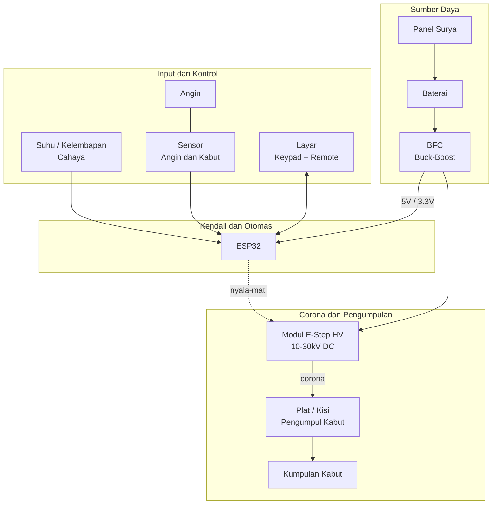

# DIAGRAM SEDERHANA — Sistem Pemenang Air Kabut (IoT)

## Gambaran Umum

Satu box berisi seluruh sistem. **Panel surya** mengisi baterai, baterai menyalakan ESP32 dan **BFC** (buck/boost converter). BFC memberi tegangan HV ke **E-Step**, sehingga medan corona muncul di antara jarum corona dan plat pengumpul. **Plat** itu yang menangkap kabut dan mengumpunkannya jadi air. ESP32 memutuskan kapan sistem hidup, dan diberi masukan dari tiga sensor (suhu, kelembapan, cahaya) serta sensor angin/kabut.

Semua di dalam satu box IP65.

## Diagram

## Penjelasan Per Blok

**Sumber Daya.** Panel surya mengisi baterai. Baterai masuk ke BFC, yang menstabilkan tegangan: keluarannya 5V/3.3V untuk ESP32, dan supply HV untuk E-Step. Rel daya 5V/3.3V ke ESP32 tidak digambar agar diagram tetap bersih; yang digambar hanya sinyal kendali nyala-mati dari ESP32 ke BFC.

**Input dan Kontrol.** Tiga masukan: sensor suhu, kelembapan dan cahaya; sensor angin atau kabut; serta layar, keypad, dan remote. Semua masuk ke ESP32.

**Kendali dan Otomasi.** ESP32 adalah otak sekaligus switch otomasi sistem. Ia membaca semua masukan, memutuskan apakah kabut cukup untuk menyalakan corona, lalu mengatur BFC — bukan HV secara langsung — sehingga hanya tegangan rendah yang disentuhnya.

**Corona dan Pengumpulan.** E-Step mengubah tegangan rendah menjadi 10-30kV DC. Medan corona mengionisasi kabut, lalu droplet bermuatan menempel ke plat. Plat itu yang menangkap air, lalu dialirkan ke penampung.

**Aliran udara.** Angin membawa kabut ke plat. Plat memisahkan air dari udara bersih, dan udara bersih keluar dari box.

## Tiga Catatan Penting

Diagram sengaja dibuat sederhana. Tiga hal ini tidak digambar karena akan bikin ramai, tapi wajib dikerjakan:

1. **Satu titik bumi.** Semua kabel HV dan semua GND elektronik bergabung di **satu titik** (star ground), lalu keluar satu kabel ke tiang bumi. Kalau dihubungkan di dua tempat, tegangan HV bisa masuk ke ESP32 dan membakarnya.
2. **Dioda 1N4007.** Pasang di setiap relay, pompa, dan modul HV. Ini menangkap lonjakan listrik saat saklar dimatikan, yang tanpa diodes bisa merusak komponen.
3. **E-STOP.** Tombol darurat memutus suplai HV **di kabel**, bukan cuma lewat program ESP32. Kalau program macet atau WiFi error, HV tetap mati.

Rinciannya ada di [archive/DIAGRAM.md](archive/DIAGRAM.md). Daftar komponen ada di [BOM.md](BOM.md).
