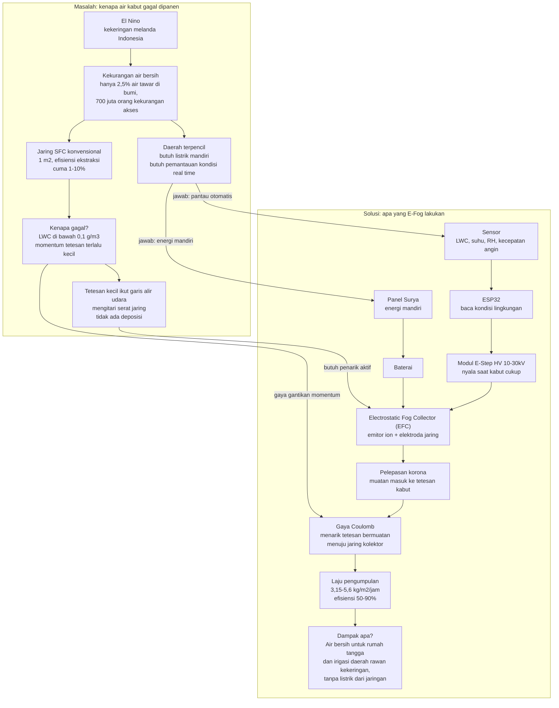

```mermaid
flowchart TD
    subgraph MASALAH["Masalah: kenapa air kabut gagal dipanen"]
        EL["El Nino<br/>kekeringan melanda Indonesia"]
        AIR["Kekurangan air bersih<br/>hanya 2,5% air tawar di bumi,<br/>700 juta orang kekurangan akses"]
        SFC["Jaring SFC konvensional<br/>1 m2, efisiensi ekstraksi<br/>cuma 1-10%"]
        SEBAB["Kenapa gagal?<br/>LWC di bawah 0,1 g/m3<br/>momentum tetesan terlalu kecil"]
        LOLOS["Tetesan kecil ikut garis alir udara<br/>mengitari serat jaring<br/>tidak ada deposisi"]
        JAUH["Daerah terpencil<br/>butuh listrik mandiri<br/>butuh pemantauan kondisi real time"]
    end

    subgraph SOLUSI["Solusi: apa yang E-Fog lakukan"]
        EFC["Electrostatic Fog Collector (EFC)<br/>emitor ion + elektroda jaring"]
        CORONA["Pelepasan korona<br/>muatan masuk ke tetesan kabut"]
        COULOMB["Gaya Coulomb<br/>menarik tetesan bermuatan<br/>menuju jaring kolektor"]
        SURYA["Panel Surya<br/>energi mandiri"]
        BATERAI["Baterai"]
        SENS["Sensor<br/>LWC, suhu, RH, kecepatan angin"]
        ESP["ESP32<br/>baca kondisi lingkungan"]
        TURUN["Modul E-Step HV 10-30kV<br/>nyala saat kabut cukup"]
        JAGO["Laju pengumpulan<br/>3,15-5,6 kg/m2/jam<br/>efisiensi 50-90%"]
        DAMPAK["Dampak apa?<br/>Air bersih untuk rumah tangga<br/>dan irigasi daerah rawan kekeringan,<br/>tanpa listrik dari jaringan"]
    end

    EL --> AIR
    AIR --> SFC
    SFC --> SEBAB
    SEBAB --> LOLOS
    AIR --> JAUH

    LOLOS -->|"butuh penarik aktif"| EFC
    SEBAB -->|"gaya gantikan momentum"| COULOMB
    JAUH -->|"jawab: energi mandiri"| SURYA
    JAUH -->|"jawab: pantau otomatis"| SENS

    SURYA --> BATERAI
    BATERAI --> EFC
    EFC --> CORONA
    CORONA --> COULOMB
    COULOMB --> JAGO
    JAGO --> DAMPAK

    SENS --> ESP
    ESP --> TURUN
    TURUN --> EFC
```

*Gambar 1. Relasi masalah dan solusi E-Fog: tiap elemen solusi menjawab bagian masalah yang spesifik.*
