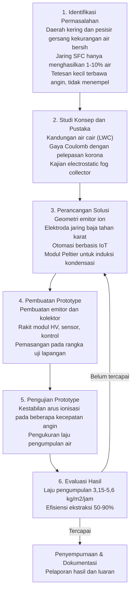

```mermaid
flowchart TD
    A["1. Identifikasi Permasalahan<br/>Daerah kering dan pesisir gersang kekurangan air bersih<br/>Jaring SFC hanya menghasilkan 1-10% air<br/>Tetesan kecil terbawa angin, tidak menempel"]
    B["2. Studi Konsep dan Pustaka<br/>Kandungan air cair (LWC)<br/>Gaya Coulomb dengan pelepasan korona<br/>Kajian electrostatic fog collector"]
    C["3. Perancangan Solusi<br/>Geometri emitor ion<br/>Elektroda jaring baja tahan karat<br/>Otomasi berbasis IoT<br/>Modul Peltier untuk induksi kondensasi"]
    D["4. Pembuatan Prototype<br/>Pembuatan emitor dan kolektor<br/>Rakit modul HV, sensor, kontrol<br/>Pemasangan pada rangka uji lapangan"]
    E["5. Pengujian Prototype<br/>Kestabilan arus ionisasi pada beberapa kecepatan angin<br/>Pengukuran laju pengumpulan air"]
    F["6. Evaluasi Hasil<br/>Laju pengumpulan 3,15-5,6 kg/m2/jam<br/>Efisiensi ekstraksi 50-90%"]
    G["Penyempurnaan & Dokumentasi<br/>Pelaporan hasil dan luaran"]

    A --> B
    B --> C
    C --> D
    D --> E
    E --> F
    F -->|"Tercapai"| G
    F -->|"Belum tercapai"| C
```

*Gambar 1. Alur metodologi penelitian E-Fog: electrostatic fog collector berbasis IoT dan tenaga surya.*
