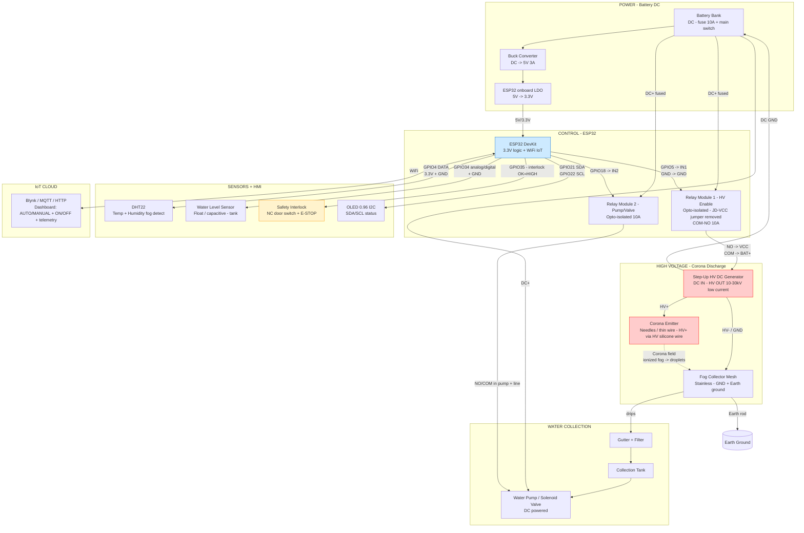

# Skema fog harvesitng josjis

```mermaid
flowchart TD
    subgraph PWR["POWER - Battery DC"]
        BAT["Battery Bank<br/>DC - fuse 10A + main switch"]
        BUCK["Buck Converter<br/>DC -> 5V 3A"]
        LDO["ESP32 onboard LDO<br/>5V -> 3.3V"]
        BAT --> BUCK --> LDO
    end

    subgraph CTRL["CONTROL - ESP32"]
        ESP32["ESP32 DevKit<br/>3.3V logic + WiFi IoT"]
        RELAY_HV["Relay Module 1 - HV Enable<br/>Opto-isolated - JD-VCC jumper removed<br/>COM-NO 10A"]
        RELAY_PUMP["Relay Module 2 - Pump/Valve<br/>Opto-isolated 10A"]
    end

    subgraph HV_SYS["HIGH VOLTAGE - Corona Discharge"]
        HVMOD["Step-Up HV DC Generator<br/>DC IN - HV OUT 10-30kV low current"]
        EMIT["Corona Emitter<br/>Needles / thin wire - HV+ via HV silicone wire"]
        MESH["Fog Collector Mesh<br/>Stainless - GND + Earth ground"]
        HVMOD -->|HV+| EMIT
        HVMOD -->|HV- / GND| MESH
        EMIT -.->|Corona field<br/>ionized fog -> droplets| MESH
    end

    subgraph SENSE["SENSORS + HMI"]
        DHT["DHT22<br/>Temp + Humidity fog detect"]
        LVL["Water Level Sensor<br/>Float / capacitive - tank"]
        INTERLOCK["Safety Interlock<br/>NC door switch + E-STOP"]
        OLED["OLED 0.96 I2C<br/>SDA/SCL status"]
    end

    subgraph WATER["WATER COLLECTION"]
        GUTTER["Gutter + Filter"]
        TANK["Collection Tank"]
        PUMP["Water Pump / Solenoid Valve<br/>DC powered"]
        MESH -->|drips| GUTTER --> TANK --> PUMP
    end

    subgraph IOT["IoT CLOUD"]
        CLOUD["Blynk / MQTT / HTTP<br/>Dashboard: AUTO/MANUAL + ON/OFF + telemetry"]
    end

    %% Power wiring
    BAT -->|DC+ fused| RELAY_HV
    BAT -->|DC+ fused| RELAY_PUMP
    BAT -->|DC+| PUMP
    LDO -->|5V/3.3V| ESP32

    %% Control wiring - GPIO
    ESP32 -->|GPIO5 -> IN1<br/>GND -> GND| RELAY_HV
    ESP32 -->|GPIO18 -> IN2| RELAY_PUMP
    RELAY_HV -->|NO -> VCC<br/>COM -> BAT+| HVMOD
    HVMOD -->|DC GND| BAT
    RELAY_PUMP -->|NO/COM in pump + line| PUMP

    ESP32 -->|GPIO4 DATA<br/>3.3V + GND| DHT
    ESP32 -->|GPIO34 analog/digital<br/>+ GND| LVL
    ESP32 -->|GPIO35 - interlock OK=HIGH| INTERLOCK
    ESP32 -->|GPIO21 SDA<br/>GPIO22 SCL| OLED

    ESP32 <-->|WiFi| CLOUD

    %% Safety
    MESH -->|Earth rod| EARTH[("Earth Ground")]

    style HVMOD fill:#ffcccc,stroke:#ff0000
    style EMIT fill:#ffcccc,stroke:#ff0000
    style INTERLOCK fill:#fff3cd,stroke:#ff9800
    style ESP32 fill:#cdeaff,stroke:#0066cc
```

