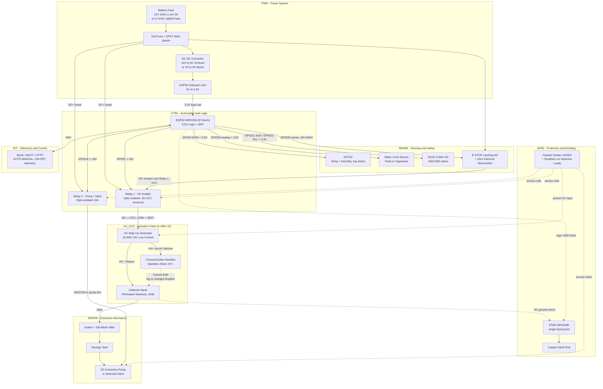

# DIAGRAM — IoT Fog Water Harvester System

## System Architecture Overview

Ambient fog is ionised by a high-voltage corona field. Charged droplets are attracted to a grounded stainless steel collector mesh, condense on it, and drip into a collection gutter, then a storage tank. An ESP32 reads ambient humidity, tank level, and a hardware safety interlock, then drives two opto-isolated relays: one enables the 10-30kV DC step-up generator, the other runs the extraction pump or solenoid valve. Telemetry and manual override run over WiFi.

The architecture enforces four non-negotiable safety invariants, each drawn explicitly below:

1. **Single-point star grounding** — the HV ground return and the logic GND meet at exactly one star point, then go to earth. This is what keeps HV common-mode noise off the ESP32.
2. **Inductive load protection** — flyback diodes (1N4007) and snubbers across relay coils, pump motor and HV module input.
3. **Dedicated E-STOP circuit** — a physical normally-closed E-STOP contact breaks the Relay 1 HV supply line in hardware, independent of firmware. GPIO35 only *senses* the same loop.
4. **HV voltage rating** — strictly the 10-30kV DC low-current corona band. Higher voltages are not achievable from battery power and are lethal without cause.

## Architecture Diagram

## Block Functional Descriptions

**`PWR` - Power System**
Standardised input topology with two accepted configurations. Configuration A: 12V 10Ah 3S Li-ion pack into a 12V-to-5V 3A buck converter. Configuration B: 3.7V/4V 18650 pack into a 4V-to-5V boost converter. Both converge on the ESP32 onboard LDO producing the 3.3V logic rail. A 10A fuse and SPST main switch sit on the positive rail ahead of every load, so one switch disarms the entire system.

**`CTRL` - Automation and Logic**
The ESP32-WROOM-32 executes the automation loop and hosts the WiFi radio. It reads ambient humidity and tank state, evaluates the AUTO thresholds, and drives two opto-isolated relay modules. Pin mapping: GPIO5 to Relay 1 (HV enable), GPIO18 to Relay 2 (pump/valve), GPIO4 to DHT22, GPIO21 and GPIO22 to the OLED over I2C, GPIO34 to the water level sensor, GPIO35 to the safety interlock sense line. Removing the JD-VCC jumper keeps the relay coil supply off the ESP32 rail, so coil noise cannot reach the MCU.

**`HV_SYS` - Ionization Field**
A 10-30kV DC low-current step-up generator drives a stainless steel corona emitter needle array at HV+ through HV-rated silicone cable. The emitter's ionises the fog; the charged droplets migrate to the grounded perforated stainless collector mesh at HV-, where they coalesce and drip. This band is the working range: sufficient field gradient to charge fog droplets, low enough current to stay non-arcing and survivable.

**`SENSE` - Sensing and Safety**
DHT22 supplies temperature and relative humidity for fog detection. The water level sensor reports tank state. The 0.96in I2C OLED shows local status. A latching normally-closed E-STOP push button plus a door interlock microswitch form one hardware loop: the loop is closed in normal operation, and any break removes HV.

**`WATER` - Extraction Mechanics**
Collected water drips from the mesh into a gutter, passes a 100-mesh pre-filter, and lands in the storage tank. A DC extraction pump or 12V solenoid valve, switched by Relay 2, moves water to the point of use.

**`IOT` - Telemetry and Control**
Blynk, MQTT, or HTTP over WiFi. Exposes an AUTO/MANUAL state machine, remote ON/OFF with interlock gating, and telemetry for humidity, tank level, HV state, and faults.

**`SAFE` - Protection and Bonding**
Three protections drawn as first-class blocks. 1N4007 flyback diodes and snubbers sit across relay coils, the pump motor, and the HV module input. The star ground is the single point where the HV ground return and the logic GND meet before going to a copper earth rod; separating these anywhere else puts HV common-mode voltage on the ESP32 ground. The E-STOP is wired in hardware ahead of Relay 1, so it disarms the HV supply whether or not firmware is running.
